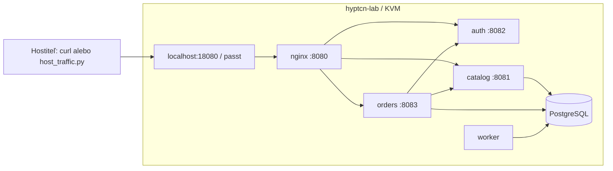

# Trvalo bežiace serverové laboratórium

`make lab-up` spustí VM `hyptcn-lab`, nasadí služby a zapne premávku z hostiteľa.
HTTP vstup je **http://127.0.0.1:18080**. Nasadenie možno zopakovať; objednávky
sa pri ňom zachovajú. `make lab-stop` zastaví generátor a požiada VM o vypnutie.



Auth vydáva podpísaný demo token, katalóg číta produkty z databázy, orders
overuje token cez auth a cenu cez catalog. Objednávku uloží do PostgreSQL.
Samostatný worker ju zmení z `pending` na `completed`. `/healthz` kontroluje
databázu, obe závislé API aj čerstvosť heartbeat workera; samotný bežiaci nginx
pre úspešný výsledok nestačí.

Demo identity nemajú heslá. Presmerovaný port je viazaný na loopback hostiteľa.
Je to benígna aplikácia na vytváranie záťaže, nie verejná obchodná služba.
Databáza a interné API počúvajú len vo VM. Dokončené objednávky staršie ako deň
worker priebežne odstraňuje; nginx používa systémové rotovanie logov.

## Spustenie na tomto stroji

```sh
cd /home/eh/Desktop/hyptcn3
make lab-up
make lab-status
make lab-test
curl -fsS http://127.0.0.1:18080/healthz
curl -fsS http://127.0.0.1:18080/api/catalog
```

Pri prvom spustení sa zo **zastavenej** existujúcej domény `hyptcn-guest`
urobí samostatná kópia disku cez `qemu-img convert`. Nový disk je
`vms/hyptcn-lab.qcow2` a nemá závislosť na pôvodnom disku. Experimentálna
doména, jej snapshot `hyptcn-clean` a pôvodné merania sa nemenia.
Zdroj musí obsahovať Debian s qemu-guest-agentom; tento repozitár jeho
existujúci lokálny disk nedistribuuje. Definovanie čistej VM na inom počítači
cez pôvodný cloud-init zostáva samostatný krok v `harness/README.md`.

Požiadavky hostiteľa: KVM, libvirt s používateľskou session, `virsh`,
`qemu-img`, `passt`, Python a používateľský systemd. Vo VM treba nginx,
PostgreSQL, Python a `python3-psycopg2`. Chýbajúci databázový ovládač pre Debian
sa stiahne na hostiteľa podľa URL a SHA-256 v `lab/dependencies.json` a odošle
cez guest-agent. Ostatné chýbajúce serverové balíky inštaluje hosť cez apt.

Sieť používa libvirt `interface type=user` s backendom `passt` a presmerovaním
TCP portu hostiteľa na nginx vo VM. Hostiteľský most ani root na túto sieť
netreba. Je to skutočné HTTP cez sieťový adaptér VM; požiadavky nespracúva
hostiteľská náhrada služieb. Nastavenie vychádza z
[libvirt Domain XML](https://libvirt.org/formatdomain.html#userspace-connection-using-slirp).
Toto laboratórium nie je izolované prostredie na spúšťanie malvéru.

## Premávka a ovládanie

`make lab-up` vytvorí používateľskú službu `hyptcn-lab-traffic.service`.
Tá beží aj po skončení terminálu, pokiaľ beží používateľský systemd.
Hosťovské služby sa spúšťajú pri boote VM; po reštarte hostiteľa spusti znovu
`make lab-up`. Trvalý autostart hostiteľskej služby sa neinštaluje.

```sh
# Stav a log hostiteľského generátora
cat data/lab/traffic.json
journalctl --user -u hyptcn-lab-traffic -n 30 --no-pager

# Zastaviť iba premávku; VM a API zostanú bežať
make lab-traffic-stop
python3 scripts/labctl.py traffic-start

# Ďalší ohraničený beh s vlastným seed a počtom klientov
python3 scripts/host_traffic.py --profile lab --target http://127.0.0.1:18080 \
  --dur 60 --seed 42 --vlakien 8 --burst 0.5 --out data/lab/manual-traffic.json

# Správa služieb vo VM cez guest-agent
python3 scripts/labctl.py logs
python3 scripts/labctl.py exec --guest-command 'systemctl status hyptcn-lab@orders --no-pager'
```

Generátor mieša čítanie katalógu, čítanie objednávok, vytváranie objednávok
a health kontroly. Každé vlákno má vlastný seedovaný generátor; súbežné
plánovanie a presné časovanie sa medzi behmi môžu líšiť. JSON obsahuje
skutočný čas behu, počty úspechov a chýb, HTTP statusy, počty podľa ciest
a latencie poslednej obmedzenej vzorky požiadaviek. Pri SIGTERM dokončí
rozpracované požiadavky a zapíše záverečné počty. HTTP chyby znamenajú
nenulový návratový kód pri ohraničenom behu.

Ručné vytvorenie objednávky:

```sh
TOKEN=$(curl -fsS http://127.0.0.1:18080/api/auth/token \
  -H 'Content-Type: application/json' -d '{"user":"demo"}' | python3 -c 'import json,sys; print(json.load(sys.stdin)["token"])')
curl -fsS http://127.0.0.1:18080/api/orders \
  -H "Authorization: Bearer $TOKEN" -H 'Content-Type: application/json' \
  -d '{"product_id":1,"quantity":2}'
curl -fsS http://127.0.0.1:18080/api/orders -H "Authorization: Bearer $TOKEN"
```

## RAM introspekcia a model

```sh
# Pevný počet snímok pri perióde nastavenej skriptom; sudo potrebuje eBPF.
sudo scripts/lab_capture.sh 24

# Zo vzniknutého adresára vytvor príznaky s existujúcim profilom jadra.
python3 -m features session --snapshot data/raw/ADRESAR_ZBERU \
  --profile profiles/debian12-6.1.0-42-cloud-amd64 \
  --out data/lab/server-session.npz
```

Zber nevracia snapshot VM, nemení jej disk ani ju po dokončení nevypína.
Zapisuje snímky, log kolektora, stav HTTP premávky pred/po a manifest do
`data/raw/`, ktoré je mimo gitu. Počet snímok overuje proti požadovanému počtu.
Pri chybe alebo prerušení ukončí vlastný kolektor a vráti vlastníctvo
artefaktov používateľovi. Pri dlhých behoch treba plánovať miesto na disku;
skript historické snímky automaticky nemaže.

Agent vo VM sa používa na nasadenie a správu aplikácie. Čítanie RAM vykonáva
existujúci hostiteľský eBPF kolektor. Oba mechanizmy sú odlišné a pôvod
profilu jadra zostáva priznanou vstupnou závislosťou.

Existujúci checkpoint z krátkych idle sedení nie je kalibrácia pre toto
serverové prostredie. Na tvrdenie o detekcii treba samostatné benígne tréningové,
kalibračné a testovacie sedenia. Laboratórium samo nedokazuje FAR/h,
citlivosť, odolnosť ani dlhodobé časové vlastnosti detektora.

Živý zber odhalil aj chybu v príznakoch: KASLR preukotvenie sa predtým robilo
len v CLI parsera. Teraz ho vykonáva aj `features.snapshot` pred čítaním
objektov; nevyriešený nesúlad znamená chybu. Staršie príznaky z iných bootov
mohli obsahovať neúplné počty a nulové sokety. Pred ďalším tréningom ich treba
vypočítať znova. Starý checkpoint slúži iba na mechanické overenie skórovania.

V `scripts/detektor.py` boli opravené tri chyby prepojenia: slicing `deque`
pri alarme, ignorovanie uloženej dĺžky okna a neplatné argumenty `hold`.
Detektor zachová reťazce celého vstupného okna a po medzere v poradí snímok
okno znovu naplní. `alarm.json` je výstup standalone detektora; týmto sa
automaticky nevolá C reakčný hook. Lokalizácia po binoch a kernelové
invarianty ešte nie sú súčasťou tohto standalone alarmu.

## Overenie

`make test` spustí C aj Python testy. `make check` kontroluje tvrdenia
a generovanú príručku. Hostiteľské Python závislosti sú v `requirements.txt`;
na bežné ovládanie laboratória a generovanie HTTP stačí štandardná knižnica.

`make lab-test` vykoná HTTP kontrolu cez hostiteľský port, overí odmietnutie
neplatného tokenu a neplatnej objednávky, vytvorí objednávku a počká na
workera. Uloží nový artefakt `data/results/lab_smoke_*.json` s identifikáciou
kódu a nameranými odpoveďami. Ide o funkčnú kontrolu aplikácie, nie
meranie kvality detekcie. Živé štatistiky v `data/lab/traffic.json` sa menia
a pre citovanie výsledku ich treba zachovať v samostatnom artefakte.
